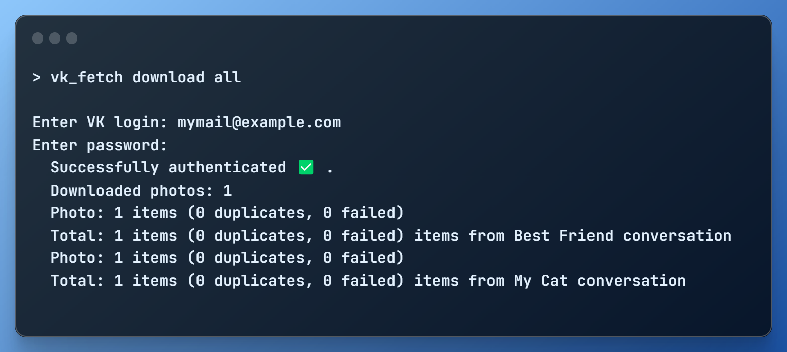
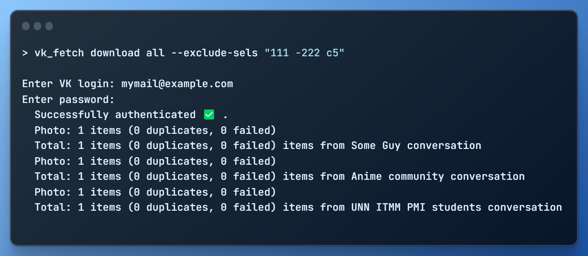
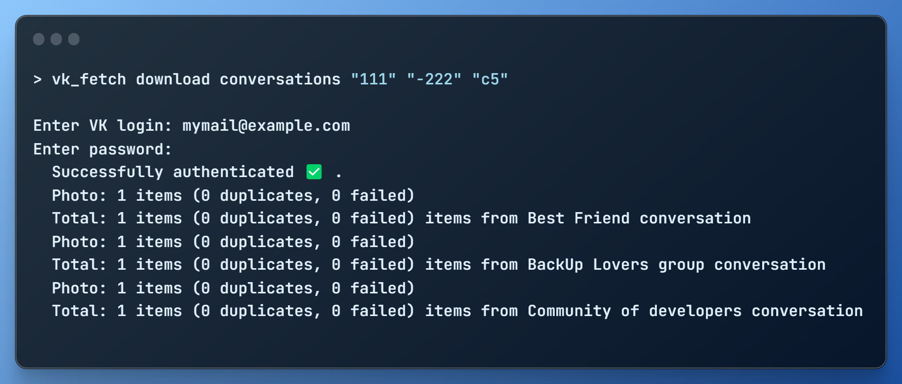
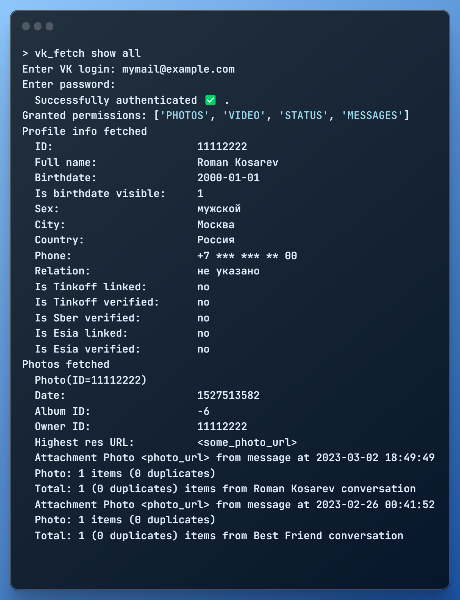

# vk_fetch

<p>
    
    
    
</p>

Script helps to fetch all data from your VK account. No need to browse every part of profile and 
manually download every single file.


## Usage

```
vk_fetch --help

 Usage: vk_fetch [OPTIONS] COMMAND [ARGS]...

 Script helps to fetch all data from your VK account

╭─ Options ────────────────────────────────────────────────────────────────────╮
│ --install-completion        [bash|zsh|fish|powershe  Install completion for  │
│                             ll|pwsh]                 the specified shell.    │
│                                                      [default: None]         │
│ --show-completion           [bash|zsh|fish|powershe  Show completion for the │
│                             ll|pwsh]                 specified shell, to     │
│                                                      copy it or customize    │
│                                                      the installation.       │
│                                                      [default: None]         │
│ --help                                               Show this message and   │
│                                                      exit.                   │
╰──────────────────────────────────────────────────────────────────────────────╯
╭─ Commands ───────────────────────────────────────────────────────────────────╮
│ download   Download data from VK profile                                     │
│ ping       Check app can connect to VK and auth as user with login/pass      │
│ show       Print available data of VK profile                                │
╰──────────────────────────────────────────────────────────────────────────────╯
```


## Sample cases

- Download all:

- Download all exclude attachments in conversations `111`, `-222`, `c5`:

- Download all attachments in conversations `111`, `-222`, `c5`:

- Show all available data to fetch:

